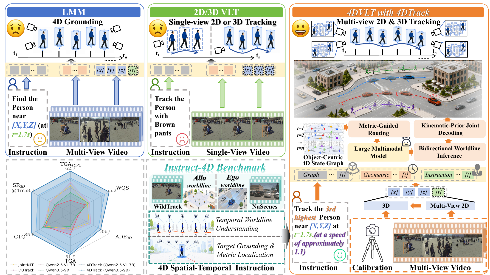
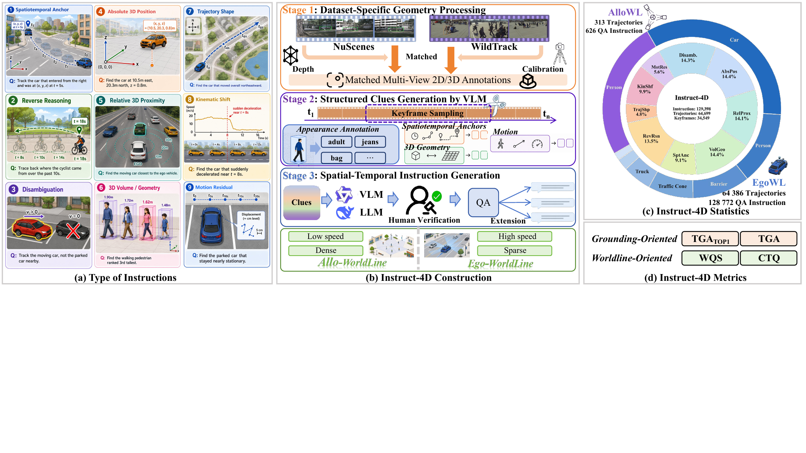
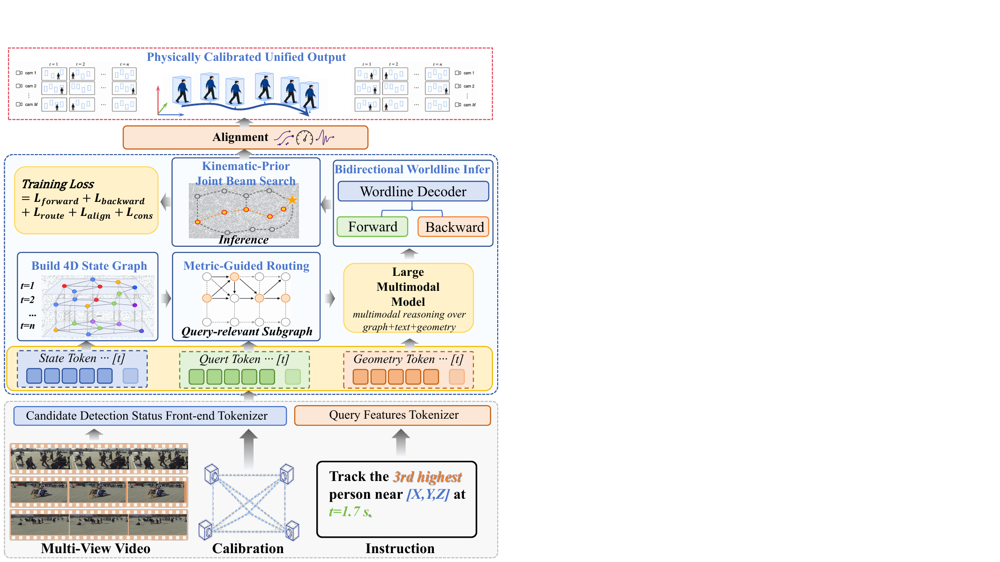
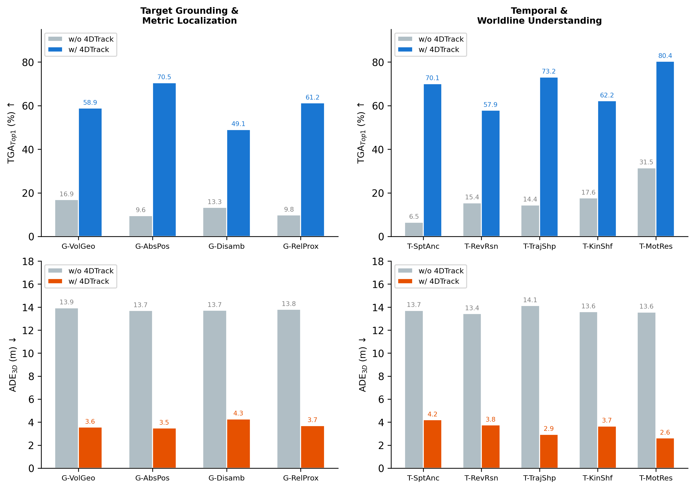

# 4DVLT

### Dynamic Scene Understanding with Worldline-Centered Vision-Language Tracking

**Language should recover an entity through space and time—not merely point to a box in one frame.**

Chaoyue Li1,†, Boxue Yang2,†, Shengyao Zhou3,†,  
Haoyang Wu1, Rui Qian2, Linfeng Zhang2,*

1Huazhong University of Science and Technology &nbsp;·&nbsp;
2Shanghai Jiao Tong University &nbsp;·&nbsp;
3Zhejiang University  
†Equal contribution &nbsp;·&nbsp; *Corresponding author

[Overview](#overview) · [Instruct-4D](#instruct-4d) · [4DTrack](#4dtrack) · [Results](#results) · [Release](#release-status)

  

## Overview

Dynamic scene understanding is not only about finding an object once. A capable model must keep the referred physical entity stable as appearance, visibility, camera view, and motion evolve—and express that entity consistently in metric 3D space and synchronized 2D views.

We introduce **4D Vision-Language Tracking (4DVLT)**, a worldline-centered task for instruction-conditioned understanding of fully observed multi-view video. Its central representation is a **worldline**: a persistent, object-centric structure that binds semantic identity, metric 3D motion, and synchronized multi-view 2D projections across time.

The project contributes two complementary pieces:

- **Instruct-4D**, a benchmark that turns spatial, temporal, geometric, and motion clues into language-conditioned worldline queries.
- **4DTrack**, a framework that organizes observations into a 4D state graph, contracts ambiguity through metric-guided routing, and decodes a physically coherent target worldline.

## Instruct-4D

<table align="center">
  <tr>
    <td align="center"><strong>129.4K</strong> instructions</td>
    <td align="center"><strong>64.7K</strong> target worldlines</td>
    <td align="center"><strong>851</strong> scenes</td>
    <td align="center"><strong>9</strong> query types</td>
  </tr>
</table>

Instruct-4D combines two complementary settings: **EgoWL**, built from dynamic egocentric driving scenes, and **AlloWL**, built from calibrated multi-camera pedestrian scenes. Its nine query types span target grounding and metric localization as well as temporal and worldline understanding, including disambiguation, reverse reasoning, trajectory shape, kinematic shift, and motion residual.

  

The benchmark separates two questions that are often conflated: **did the model identify the referred entity?** and **did it recover a faithful worldline for that entity?** Accordingly, TGA and TGATop1 measure sequence-level and first-timestamp grounding, while WQS and CTQ evaluate unconditional and correctly grounded worldline quality.

## 4DTrack

  

4DTrack casts 4DVLT as query-conditioned worldline inference:

1. An **object-centric 4D state graph** links candidate physical states across time and views.
2. **Metric-guided routing** uses language, geometry, and reachability to retain a query-relevant subgraph.
3. **Bidirectional worldline decoding** exploits the fully observed clip to resolve non-local temporal dependencies.
4. **Kinematic-prior joint decoding** calibrates the recovered path toward physically plausible motion.
5. A view-aware alignment stage produces a unified 3D trajectory and synchronized multi-view 2D boxes.

The ablations reveal a metric-specific division of labor. Routing carries nearly all of the first-timestamp grounding gain, while graph structure, bidirectional decoding, and kinematic calibration are expressed more strongly through sequence-level grounding and worldline-quality metrics. The modules therefore form a coupled inference chain with different responsibilities rather than interchangeable sources of improvement.

## Results

4DTrack consistently improves matched multimodal backbones under the shared Instruct-4D evaluation interface. With Qwen3.5-9B, the full framework reaches **62.68 TGATop1**, **51.93 TGA**, **55.18 WQS**, and **85.57 CTQ**, while reducing 3D trajectory error to **3.67 m ADE3D**.

| Model | TGATop1 ↑ | TGA ↑ | WQS ↑ | CTQ ↑ | ADE3D ↓ | SR3D@1m ↑ |
|:--|--:|--:|--:|--:|--:|--:|
| Qwen3.5-9B | 14.12 | 10.13 | 13.99 | 55.90 | 13.71 | 11.38 |
| **4DTrack-Qwen3.5-9B** | **62.68** | **51.93** | **55.18** | **85.57** | **3.67** | **58.27** |

  

The query-level analysis shows where worldline-centered structure matters most. Performance is strongest when an instruction can be expressed directly through metric position or motion—such as absolute 3D position, trajectory shape, and motion residual. Dense same-category disambiguation remains the most difficult regime, especially when nearby candidates share appearance and motion patterns.

## Release Status

| Artifact | Status |
|:--|:--|
| Source code | **Coming soon** |
| Instruct-4D benchmark | **Coming soon** |
| Model checkpoints | **Coming soon** |
| arXiv preprint | **Coming soon** |

Citation metadata and download instructions will be added with the public release.

## License

This project is released under the [MIT License](LICENSE).

